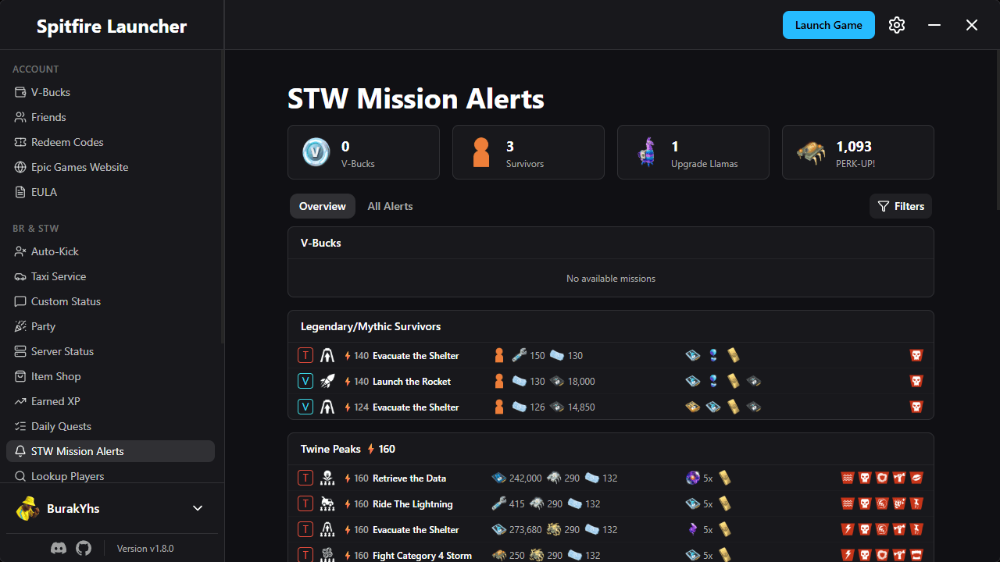

# Dozamigos Launcher

A launcher for Fortnite Battle Royale and Save the World by **Heyash**.



## Installation

Build from source or use a release installer from the project releases.

## Key Features

- Multiple account support
- Portuguese (Brazil) UI
- Auto-kick: Kick instantly, auto-claim rewards, auto-transfer materials and auto-invite your friends when the STW mission ends
- Download games: Download and launch games from the Epic Games Store
- View item shop, STW quests and mission alerts
- Friend management
- Authentication: Generate access tokens, exchange codes and device auths for your account

## Bug Reports & Feature Requests

When reporting bugs, keep **Enable Debug Logs** turned on and include as much detail as possible (logs, steps to reproduce, screenshots, etc.).  
Logs can be found in F12 -> Console.

## Development Setup

### Prerequisites

1. **Install Bun**
   - Windows:
     ```powershell
     powershell -c "irm bun.sh/install.ps1 | iex"
     ```
   - Linux & macOS:
     ```sh
     curl -fsSL https://bun.sh/install | bash
     ```

2. **Setup Tauri**
   - Follow the official prerequisites guide:  
     https://v2.tauri.app/start/prerequisites

### Configuring Android (Optional)

To build the launcher for Android, you’ll need to create and configure a signing keystore.  
Follow the official Tauri guide [here](https://v2.tauri.app/distribute/sign/android/#configure-the-signing-key).  
You can skip the Gradle steps since it is already configured.

### Running the App

```sh
bun install
# Dev profile (identifier com.dozamigos-launcher.dev — can run beside installed build)
bun run tauri:dev
# Or default: bun tauri dev
```

Prod and Dev use different app identifiers / AppData folders so both can stay open.

### Building the Windows Installer

```sh
bun run tauri:build
```

The NSIS installer is generated under `src-tauri/target/release/bundle/nsis/`.

Version: **0.1.0**

### Automatic Updates (not enabled yet)

The app checks
`https://github.com/luanwolf/DozamigosLauncher/releases/latest/download/latest.json` on startup.
Release builds must set `TAURI_SIGNING_PRIVATE_KEY` to the private key matching the `pubkey` in
`src-tauri/tauri.conf.json`. GitHub Actions reads this key from the repository secret with the same
name and publishes the signed installer, its signature, and `latest.json`.

## License

This project is licensed under the GNU General Public License v3.0 – see the [LICENSE](LICENSE) file for details.
