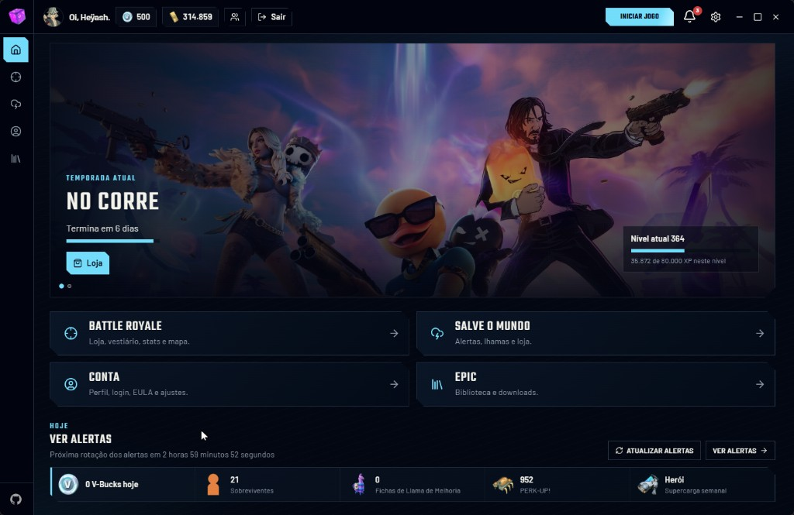

<p align="center">
  
</p>

<p align="center">
  <a href="https://github.com/luanwolf/DozamigosLauncher/releases/latest"></a>
  
  <a href="LICENSE"></a>
</p>

Um launcher em português para quem joga Fortnite de verdade: Battle Royale, Salve o Mundo (STW) e a
biblioteca da Epic Games na mesma janela. Ele nasceu para resolver a chatice do dia a dia — trocar de conta,
conferir a loja, resgatar lhama, ver alerta de missão — sem precisar abrir cinco sites e o jogo.

Feito por **Heyash**.



## Começando

1. Baixe o instalador `.exe` na [página de releases](https://github.com/luanwolf/DozamigosLauncher/releases/latest).
2. Instale e abra o launcher.
3. Na primeira vez, uma tela de boas-vindas pede sua conta Epic e a pasta onde o Fortnite está instalado. Feito isso, você já cai na home.

> [!TIP]
> Não precisa se preocupar com atualização: ao abrir, o app confere a última release, baixa e instala sozinho.

## O que dá pra fazer

### Battle Royale

| Recurso | Detalhe |
| --- | --- |
| Loja de itens | Prévia em vídeo, áudio das músicas e emotes, estilos de cada cosmético e exportação da loja em imagem |
| Ofertas especiais | Promoções em dinheiro real da Epic e da PSN |
| Vestiário | Filtro por categoria, prévia em vídeo do item e exportação do vestiário em imagem 1:1 |
| Estatísticas e XP | Suas stats de BR e o XP ganho na temporada |
| Extras | Mapa atual, status dos servidores, vazamentos, compra de V-Bucks e apoiar um criador |

### Salve o Mundo (STW)

- **Alertas de missão** com as recompensas da rotação atual.
- **Lhamas grátis** com resgate automático: o launcher varre as contas de hora em hora (no horário UTC) e resgata para todo mundo que deixou a opção ligada.
- **Loja do STW** e **missões diárias**.
- **Auto-kick**: sai da missão na hora, resgata as recompensas, transfere materiais e convida seus amigos quando a missão acaba.

### Conta e Epic Games

- Várias contas cadastradas, com troca rápida — o login de todas acontece quando o app abre, então trocar de aba não faz você esperar de novo.
- Perfil, lista de amigos, EULA e ajustes num lugar só.
- Autenticação: gera tokens de acesso, exchange codes e device auths.
- Biblioteca da Epic: baixe, atualize e inicie seus jogos.
- Jogos grátis da semana, já marcados como **Resgatado** na home quando você pegou.

## Dicas do dia a dia

- **Trocar de conta:** pelo topo da janela. Para cadastrar outra, vá em _Conta → Conta_ e siga o login da Epic.
- **Jogar:** botão _Iniciar jogo_ no topo. O caminho da instalação você muda em _Ajustes_.
- **Exportar loja ou vestiário:** abra a página, clique em _Exportar_ e espere a barra de progresso. O `.webp` fica em `%APPDATA%\dozamigos-launcher\exports`, e o botão _Abrir imagem_ aparece ao lado assim que termina.
- **Resgate automático de lhamas:** ligue em _STW → Lhamas grátis_. A varredura roda mesmo com o app minimizado.

> [!IMPORTANT]
> Achou um bug? Ligue **Logs de depuração** em _Ajustes_, repita o que deu errado e abra uma
> [issue](https://github.com/luanwolf/DozamigosLauncher/issues) com os logs (F12 → Console), os passos e um print.
> Quanto mais detalhe, mais rápido sai o conserto.

## Desenvolvimento

<details>
<summary>Rodar e compilar o projeto</summary>

### Pré-requisitos

1. **Bun**
   - Windows: `powershell -c "irm bun.sh/install.ps1 | iex"`
   - Linux e macOS: `curl -fsSL https://bun.sh/install | bash`
2. **Tauri** — siga o [guia oficial de pré-requisitos](https://v2.tauri.app/start/prerequisites).

### Rodando

```sh
bun install
bun run tauri:dev
```

O perfil de dev usa o identificador `com.dozamigos-launcher.dev` e uma pasta própria no AppData, então ele
roda ao lado da versão instalada sem misturar contas nem configurações.

### Gerando o instalador

```sh
bun run tauri:build
```

O instalador NSIS sai em `src-tauri/target/release/bundle/nsis/`. As artes do instalador e o banner deste
README são gerados por `src-tauri/installer/build-images.ps1` e `scripts/build-banner.ps1` — rode os scripts
de novo sempre que o ícone ou a marca mudar.

### Atualização automática

O app consulta `https://github.com/luanwolf/DozamigosLauncher/releases/latest/download/latest.json` ao iniciar.
Builds de release precisam da variável `TAURI_SIGNING_PRIVATE_KEY` com a chave privada correspondente ao
`pubkey` de `src-tauri/tauri.conf.json`. O GitHub Actions lê essa chave do secret de mesmo nome e publica o
instalador assinado, a assinatura e o `latest.json`.

</details>

## Créditos

O Dozamigos Launcher é construído em cima do [Spitfire Launcher](https://github.com/bur4ky/spitfire-launcher),
do [Burak (bur4ky)](https://github.com/bur4ky). Toda a base original é mérito dele; aqui ela ganhou interface
em português, páginas novas e um monte de ajuste para o nosso jeito de jogar. Valeu, Burak!

## Licença

GNU General Public License v3.0 — os detalhes estão em [LICENSE](LICENSE).
